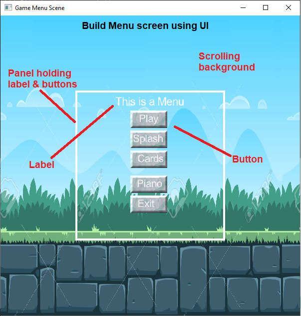

## Update Feb 07, 2024
    Update to Raylib 5.0 
    
## Update June 14, 2023
    Quick update getting ready to do Raylib 3D games. Moved all TransformComponent def from "Component.cs" class to individual 2D components.
    
    This will allow for creation of 3D components that can inherit from Component.cs class also.
    
    Scene.cs was updated to allow for Raylib.BeginMode3D or Raylib.BeginMode2D (WIP, so stay tuned)

## Update June 6, 2023
    Added Raylib-CS as a NuGet package
    
    Added Sanford MIDI project (all in ONE project so to upgrade to NET 7.0)
    
    Many changes to mmGameEngine
    
    Update of UI components
    
    Added new scene with MIDI piano
    
    Added new scene as splash screen
    

A Game Engine using Raylib as the core, Entitas lite as the ECS engine.

The engine and a sample Menu + few other scenes with sprites, animated sprites, compound sprites + simple card game, 

https://github.com/ChrisDill/Raylib-cs         (use NuGet package, much easier)

https://github.com/rocwood/Entitas-Lite        (I've included Entitas here, since I made some minor additions)

Entity Component System (ECS) is used to allow for separation of concern when coding. 

Scene is the base of the game.  Inside the Scene you add Entities that have Components.  Then you add a System to act on those entities.  If you don't add a system, you all you get is a scene displaying a bunch of things (like the Card Scene).  

There are components that have special meaning.  

    Each game is a scene holding Entities.
        
        * Game Entity (what is used to do the game)
        
        * Scene Entity (typically UI elements that are drawn on top of all Game Entities)
        
    Transform component gets added to all entities when scene creates them.
    
    Sprite component is used to display images
    
    SpriteAnimation component adds an animated sprite using spritesheet
    
    Tiled map component adds a TmxMap that allows you to access all of its levels & objects
    
    Text compoenent addes a text and will follow the entity on the screen 
    
    BoxCollider component allows the Entity to collide with other entities that have a collider
    
Systems do the guts of the logic of the game.  They are executed once every frame and process all entities that match certain components (that we give them).

Below examples have "Debug" flag on.  F9 will flip "Debug" off/on.  The tank will move using arrow keys.  The red boxes are BoxColliders drawn as debug guide.

## To Start a VS2022 project:

    Start with Net 7.0 console app
    
    Using Dependencies add Raylib-cs Nuget package
    
    Add references to Entitas-Lite , mmGameEngine and Sanford.MIDI
 
## Your Program.cs

    using mmGameEngine;

    namespace TestmmGame
    {
        class Program
        {
            static void Main(string[] args)
            {

                TestGame game = new TestGame();

            }
        }
        public class TestGame : mmGame
        {
            public TestGame() : base()
            {
                Scene = new MenuScene();
            }
        }
    }

## Main Menu Scene

The Menu scene uses the engine GUI component called Panel which has other components in it (buttons & label).
Panel is a Scene Entity (meaning it will be drawn on top of everything) and has Color.BLANK so you can see thru it.

The background image is a Game Entity with a Sprite component.

## Play Scene

## Card Game Scene

## MIDI Piano Scene

